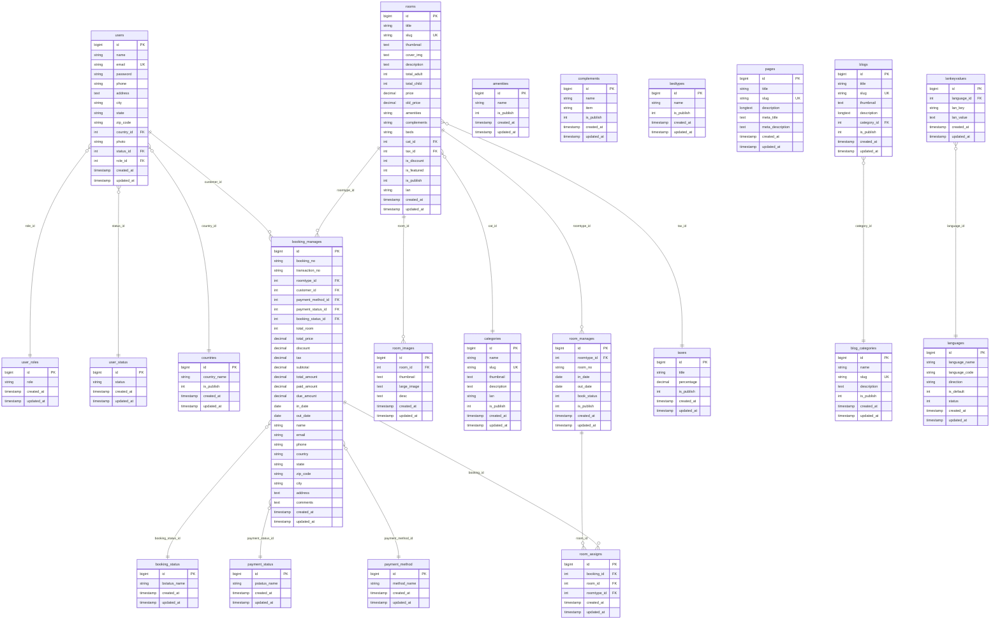
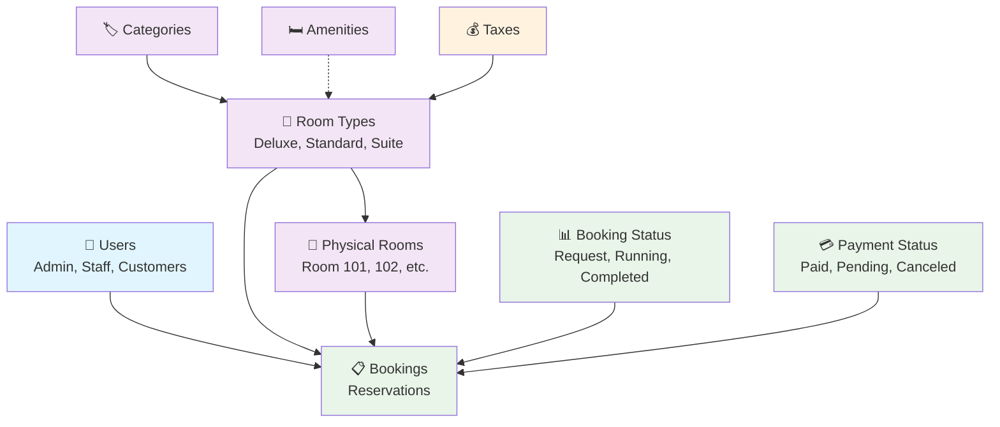

# Hotel Management System - Database Schema Diagram

## Entity Relationship Diagram (Mermaid)



## Simplified Core Relationships



## Dashboard Data Flow

```mermaid
flowchart TD
    A[Dashboard Controller] --> B{Fetch Metrics}
    
    B --> C[Financial Metrics]
    B --> D[Booking Metrics]
    B --> E[Room Metrics]
    B --> F[Customer Metrics]
    
    C --> C1[Total Earnings<br/>booking_status_id=3 AND payment_status_id=1]
    C --> C2[Pending Payments<br/>payment_status_id=2]
    C --> C3[Canceled Payments<br/>payment_status_id=3]
    C --> C4[Incomplete Payments<br/>payment_status_id=4]
    
    D --> D1[Completed Bookings<br/>booking_status_id=3]
    D --> D2[Running Bookings<br/>booking_status_id=2]
    D --> D3[Booking Requests<br/>booking_status_id=1]
    D --> D4[Canceled Bookings<br/>booking_status_id=4]
    
    E --> E1[Total Room Types<br/>rooms WHERE is_publish=1]
    E --> E2[Total Rooms<br/>room_manages WHERE is_publish=1]
    E --> E3[Today's Booked<br/>book_status=1 AND today]
    E --> E4[Available Rooms<br/>book_status=2]
    
    F --> F1[Active Customers<br/>role_id=2 AND status_id=1]
    F --> F2[Inactive Customers<br/>role_id=2 AND status_id=2]
    F --> F3[Total Users<br/>role_id IN (1,3)]
    
    style A fill:#ff9999
    style C fill:#99ccff
    style D fill:#99ff99
    style E fill:#ffcc99
    style F fill:#cc99ff
```